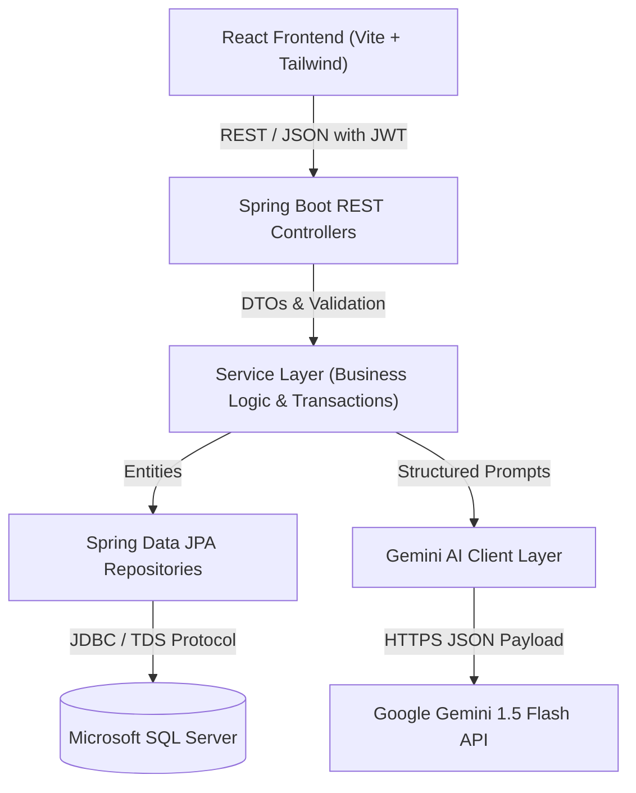

# AI Mock Interview Platform

A production-ready, full-stack AI Mock Interview platform built with **Spring Boot 3 (Java 17/21)**, **Microsoft SQL Server**, **Google Gemini AI**, and **React 18 (Vite)**. The platform enables candidates to conduct adaptive, role-tailored technical and behavioral mock interviews with real-time AI evaluation, multi-dimensional scoring (Technical, Relevance, Clarity, Depth), comprehensive post-interview reports, PDF resume parsing, performance analytics, and administrative management.

---

## 📑 Table of Contents
1. [Architecture & System Design](#-architecture--system-design)
2. [Key Features](#-key-features)
3. [Technology Stack](#-technology-stack)
4. [Project Structure](#-project-structure)
5. [Database Schema & Design](#-database-schema--design)
6. [API Reference Documentation](#-api-reference-documentation)
7. [Gemini AI Integration & Prompt Engineering](#-gemini-ai-integration--prompt-engineering)
8. [Security & Secrets Policy](#-security--secrets-policy)
9. [Local Setup & Installation Guide](#-local-setup--installation-guide)
10. [Running Automated Tests](#-running-automated-tests)
11. [Docker Deployment](#-docker-deployment)
12. [Portfolio Placement Interview Q&A (20 Architecture Questions)](#-placement-interview-qa-guide)

---

## 🏛 Architecture & System Design

The platform follows a layered clean architecture with strict separation of concerns:



### Backend Request Lifecycle
```
Controller Layer (HTTP Request / Response, Route Mapping, DTO Validation)
       ↓
Service Layer (Business Rules, @Transactional, State Validations, Security Auditing)
       ↓
AI Client Layer (Prompt Builder, Gemini REST Client, JSON Response Parser & Heuristic Fallbacks)
       ↓
Repository Layer (Spring Data JPA, Hibernate, Custom Queries)
       ↓
Database (Microsoft SQL Server / In-Memory H2 for Test Profile)
```

---

## 🚀 Key Features

- **Adaptive AI Interviewing**: Questions are generated dynamically one at a time. The AI calibrates subsequent questions based on candidate performance, previous answers, and technical depth.
- **4-Dimensional Scoring**: Evaluates candidate answers across:
  1. *Technical Accuracy* (1-10)
  2. *Relevance & Precision* (1-10)
  3. *Communication Clarity* (1-10)
  4. *Architectural Depth* (1-10)
- **Resume-Driven Interviews**: Upload PDF resumes to extract technologies and real-world projects via Apache PDFBox and Gemini AI, generating cross-examination questions.
- **Executive Post-Interview Reports**: Provides overall percentile scoring, identified candidate strengths, critical gaps, recommended revision topics, and actionable feedback.
- **Candidate Analytics Dashboard**: Displays interview completion trends, score history, and technical domain breakdown.
- **Role-Based Access Control (RBAC)**: Secure user registration and login with stateless JWT tokens, distinguishing between `ROLE_USER` and `ROLE_ADMIN`.
- **System Administration Console**: Manage candidates, toggle account active states, and monitor platform statistics.

---

## 🛠 Technology Stack

### Backend
- **Java 17 LTS / 21 LTS**
- **Spring Boot 3.2.4** (Spring Web, Spring Data JPA, Spring Security 6, Bean Validation)
- **Database**: Microsoft SQL Server (`mssql-jdbc`) & H2 Database (for automated test suite)
- **Security**: Stateless JWT (`io.jsonwebtoken:jjwt`), BCrypt password hashing
- **AI Integration**: Google Gemini 1.5 Flash REST API with JSON schema enforcement
- **PDF Extraction**: Apache PDFBox 3.0.2
- **Documentation**: SpringDoc OpenAPI / Swagger UI 2.3.0
- **Testing**: JUnit 5, Mockito, Spring Boot Test

### Frontend
- **React 18** & **Vite 5**
- **Routing**: React Router DOM 6
- **Styling**: Tailwind CSS, Lucide React Icons
- **HTTP Client**: Axios with centralized request/response interceptors

---

## 📂 Project Structure

```
ai-mock-interview-platform/
├── backend/
│   ├── pom.xml
│   ├── mvnw / mvnw.cmd
│   ├── src/
│   │   ├── main/
│   │   │   ├── java/com/aimock/interview/
│   │   │   │   ├── config/          # Security, OpenAPI, CORS, Gemini Config
│   │   │   │   ├── entity/          # JPA Entities: User, Role, Interview, Question, Answer, Report, AuditLog
│   │   │   │   ├── dto/             # DTOs: Auth, Interview, Question, Answer, Report, Dashboard, Admin, AI
│   │   │   │   ├── repository/      # Spring Data JPA Repositories
│   │   │   │   ├── security/        # JWT Token Provider, Auth Filter, UserDetailsService
│   │   │   │   ├── service/         # Service interfaces and implementations
│   │   │   │   ├── ai/              # Gemini Client, Prompt Builder, Response Parser
│   │   │   │   ├── exception/       # GlobalExceptionHandler, Custom Exceptions
│   │   │   │   └── util/            # JsonUtils, Constants
│   │   │   └── resources/
│   │   │       ├── application.properties
│   │   │       ├── application-example.properties
│   │   │       ├── application-test.properties
│   │   │       └── schema-sqlserver.sql
│   │   └── test/java/com/aimock/interview/
│   │       ├── AuthServiceTest.java
│   │       ├── InterviewServiceTest.java
│   │       ├── AnswerServiceTest.java
│   │       └── GeminiServiceTest.java
├── frontend/
│   ├── package.json
│   ├── vite.config.js
│   ├── tailwind.config.js
│   ├── src/
│   │   ├── api/                     # Centralized Axios Client & API modules
│   │   ├── context/                 # AuthContext (user session, login, logout)
│   │   ├── components/              # Navbar, Sidebar, Route Guards, StatCard, UI Helpers
│   │   ├── pages/                   # Landing, Login, Register, Dashboard, Interview Room, Report, etc.
│   │   └── routes/                  # AppRoutes
├── docker/
│   ├── Dockerfile.backend
│   ├── Dockerfile.frontend
│   └── docker-compose.yml
└── README.md
```

---

## 🗄 Database Schema & Design

The database schema is designed for Microsoft SQL Server with primary keys, foreign keys, unique constraints, and indexes.

### Core Tables
1. **`users`**: Candidate accounts (`id`, `email`, `password`, `full_name`, `target_role`, `years_of_experience`, `enabled`).
2. **`roles` & `user_roles`**: RBAC permissions (`ROLE_USER`, `ROLE_ADMIN`).
3. **`interviews`**: Session header (`id`, `user_id`, `job_role`, `experience_level`, `difficulty`, `interview_type`, `status`, `total_questions`, `completed_questions`, `overall_score`, `resume_extracted_text`).
4. **`questions`**: Sequence-tracked questions (`id`, `interview_id`, `sequence_number`, `question_text`, `question_type`, `technology`).
5. **`answers`**: Candidate answers & scores (`id`, `question_id`, `answer_text`, `technical_score`, `relevance_score`, `clarity_score`, `depth_score`, `overall_score`, `feedback`, `strengths_json`, `weaknesses_json`).
6. **`interview_reports`**: Post-interview synthesis report (`id`, `interview_id`, `overall_score`, `technical_score`, `communication_score`, `relevance_score`, `strengths_json`, `weaknesses_json`, `recommended_topics_json`, `improvement_suggestions_json`, `summary`).
7. **`audit_logs`**: System audit trail (`id`, `user_id`, `action`, `resource_type`, `resource_id`, `details`, `created_at`).

---

## 🌐 API Reference Documentation

When running locally, full interactive documentation is available at:
👉 **`http://localhost:8080/swagger-ui.html`**

### Authentication
- `POST /api/auth/register` - Register a new candidate
- `POST /api/auth/login` - Authenticate and retrieve JWT token
- `GET /api/auth/me` - Introspect current user profile

### Interview Lifecycle
- `POST /api/interviews` - Create a new interview session
- `GET /api/interviews` - Retrieve paginated user interview history
- `GET /api/interviews/{id}` - Get full interview details (questions, answers, scores)
- `POST /api/interviews/{id}/start` - Start interview and generate 1st question with Gemini
- `POST /api/interviews/{id}/answers` - Submit answer for evaluation & generate adaptive follow-up
- `POST /api/interviews/{id}/complete` - Finalize interview and generate synthesis report
- `DELETE /api/interviews/{id}` - Cancel an active interview session
- `GET /api/interviews/{id}/report` - Retrieve final evaluation report

### Dashboard & Profile
- `GET /api/dashboard/summary` - Metrics summary (total rounds, avg score, recent sessions, focus areas)
- `GET /api/dashboard/performance` - Detailed performance breakdowns
- `GET /api/users/profile` & `PUT /api/users/profile` - Manage candidate profile

### Resume-Based Interview
- `POST /api/resume/upload` - Upload PDF resume and extract skills/projects
- `POST /api/resume/interview` - Create session tailored to resume content

### Admin APIs (`ROLE_ADMIN` only)
- `GET /api/admin/users` - Paginated user directory
- `PATCH /api/admin/users/{id}/status` - Enable or disable candidate accounts
- `GET /api/admin/statistics` - Platform-wide statistics

---

## 🤖 Gemini AI Integration & Prompt Engineering

The Gemini integration is encapsulated in `com.aimock.interview.ai`:
- **`GeminiPromptBuilder`**: Constructs domain-specialized prompts instructing the AI to act as a rigorous technical interviewer.
- **`GeminiClient`**: Communicates with `https://generativelanguage.googleapis.com/v1beta/models/{model}:generateContent` using structured JSON output (`responseMimeType: application/json`).
- **`GeminiResponseParser`**: Extracts and validates typed JSON models with robust heuristic fallbacks in case of temporary network or API timeouts.
- **Security**: The Gemini API key is never exposed to the frontend; all AI communications are mediated through Spring Boot backend services.

---

## 🔒 Security & Secrets Policy

1. **Zero Hardcoded Secrets**: `application.properties` uses environment variable placeholders:
   - `${DB_URL}`
   - `${DB_USERNAME}`
   - `${DB_PASSWORD}`
   - `${JWT_SECRET}`
   - `${GEMINI_API_KEY}`
2. **Developer Templates**: `application-example.properties` and `.env.example` provide reference configurations without credentials.
3. **Data Protection**: Passwords hashed using BCrypt (`BCryptPasswordEncoder`).
4. **Ownership Verification**: All interview endpoints verify that the requesting user owns the interview record or possesses `ROLE_ADMIN`.

---

## 💻 Local Setup & Installation Guide

### Prerequisites
- **Java 17 LTS or 21 LTS**
- **Node.js 18+ & npm**
- **Microsoft SQL Server** (Local instance or SQL Server Express) or Docker

### 1. Database Setup (SQL Server)
Open SQL Server Management Studio (SSMS) or `sqlcmd` and create the database:
```sql
CREATE DATABASE aimockinterview;
```

### 2. Backend Setup
1. Open `backend/src/main/resources/application.properties` (or supply environment variables):
   ```properties
   spring.datasource.url=jdbc:sqlserver://localhost:1433;databaseName=aimockinterview;encrypt=true;trustServerCertificate=true;
   spring.datasource.username=YOUR_SQLSERVER_USERNAME
   spring.datasource.password=YOUR_SQLSERVER_PASSWORD
   app.jwt.secret=YOUR_BASE64_256_BIT_SECRET_KEY
   gemini.api.key=YOUR_GEMINI_API_KEY
   ```
2. Run the backend using the included Maven Wrapper:
   ```bash
   cd backend
   ./mvnw spring-boot:run
   ```
   Backend will start on `http://localhost:8080`.

### 3. Frontend Setup
1. Navigate to the `frontend` directory and install dependencies:
   ```bash
   cd frontend
   npm install
   ```
2. Start the Vite development server:
   ```bash
   npm run dev
   ```
3. Open your browser at **`http://localhost:5173`**.

---

## 🧪 Running Automated Tests

Run backend unit and integration tests using the automated test profile (H2 in-memory mode, no active SQL Server required):
```bash
cd backend
./mvnw test -Dspring.profiles.active=test
```

To build and verify the frontend production bundle:
```bash
cd frontend
npm run build
```

---

## 🐳 Docker Deployment

To launch the full stack (SQL Server + Spring Boot Backend + React Frontend) using Docker Compose:
```bash
cd docker
docker-compose up --build
```

---

## 🎓 Placement Interview Q&A Guide

Below are detailed architectural answers to 20 technical interview questions:

#### 1. Why Spring Boot?
Spring Boot provides an enterprise-ready framework with production-grade dependency injection, seamless database transaction management (`@Transactional`), integrated security with Spring Security 6, and a broad ecosystem of battle-tested starters.

#### 2. Why Microsoft SQL Server?
SQL Server provides ACID compliance, clustered and non-clustered indexing, relational integrity, execution plan optimization, and native integration for enterprise backend infrastructures.

#### 3. Why JPA / Hibernate?
JPA abstracts relational mapping into object models, automates dirty checking, manages relational cascades, and standardizes queries while allowing native queries where performance tuning is required.

#### 4. Why use DTOs instead of exposing Entities?
Exposing JPA entities directly creates tight coupling, risks infinite JSON recursion, exposes sensitive database fields (such as password hashes), and prevents independent API contract versioning.

#### 5. Why JWT?
JWT allows stateless authentication where the backend verifies tokens using cryptographic signatures without querying a session store on every request, allowing easy horizontal scaling.

#### 6. How does authentication work?
The candidate sends credentials to `POST /api/auth/login`. Spring Security's `AuthenticationManager` verifies the BCrypt hash. Upon success, a signed JWT token containing the user ID and claims is issued.

#### 7. How does authorization work?
Requests pass through `JwtAuthenticationFilter`, which extracts and validates the token, populates the `SecurityContext` with `UserPrincipal` and authorities (`ROLE_USER` / `ROLE_ADMIN`), and evaluates `@PreAuthorize` rules.

#### 8. How does React communicate with Spring Boot?
React uses an Axios client configured with a base URL, request interceptors that inject the `Authorization: Bearer <token>` header, and response interceptors that handle 401 token expirations.

#### 9. How does Spring Boot communicate with Gemini?
Spring Boot uses Spring's `RestClient` to dispatch JSON payloads containing structured prompt instructions to Gemini's `generateContent` endpoint with `responseMimeType: application/json`.

#### 10. How do you prevent Gemini API key exposure?
The Gemini API key is maintained securely on the server side in backend environment variables. React only communicates with Spring Boot endpoints.

#### 11. How do you evaluate an answer?
The candidate's answer is evaluated across 4 dimensions: Technical Accuracy, Relevance, Clarity, and Depth. Gemini assigns scores (1-10) and provides structured feedback along with strengths and weaknesses.

#### 12. How does adaptive questioning work?
The backend maintains session history. The prompt builder supplies previous questions, answers, and scores to Gemini, instructing it to increase difficulty or shift topics based on the candidate's responses.

#### 13. How are interview sessions stored?
Interview sessions are stored in relational tables (`interviews`, `questions`, `answers`, `interview_reports`) linked by UUID foreign keys.

#### 14. How do you prevent one user accessing another user's interview?
Service layer methods validate that `interview.getUser().getId().equals(currentUserId)` before processing or returning any data.

#### 15. How do you handle Gemini API failure?
`GeminiClient` catches timeouts and rate-limiting errors. `GeminiResponseParser` provides fallback responses and educational feedback, ensuring interview flow continues without crashing.

#### 16. How do you handle duplicate submissions?
`AnswerServiceImpl` verifies that no existing record in `answers` references the question ID, and database unique constraints on `question_id` prevent duplicate submissions.

#### 17. Why use transactions (`@Transactional`)?
`@Transactional` ensures atomicity. When completing an interview or saving an answer, all related entity updates, status changes, and report persistences either commit together or roll back cleanly on error.

#### 18. How is the database designed?
A normalized 3NF relational design with foreign key constraints, unique constraints on `(interview_id, sequence_number)`, and indexes on frequently queried columns (`user_id`, `status`, `created_at`).

#### 19. How would you scale the application?
1. Enable horizontal scaling of stateless Spring Boot instances behind an ALB/Nginx load balancer.
2. Introduce Redis for caching dashboard summaries and rate limiting.
3. Configure SQL Server Read Replicas for read-heavy reporting queries.

#### 20. What would you change for production?
1. Introduce Flyway or Liquibase for versioned database migrations.
2. Deploy secrets through AWS Secrets Manager, Azure Key Vault, or HashiCorp Vault.
3. Configure Prometheus & Grafana metrics alongside distributed tracing (OpenTelemetry).